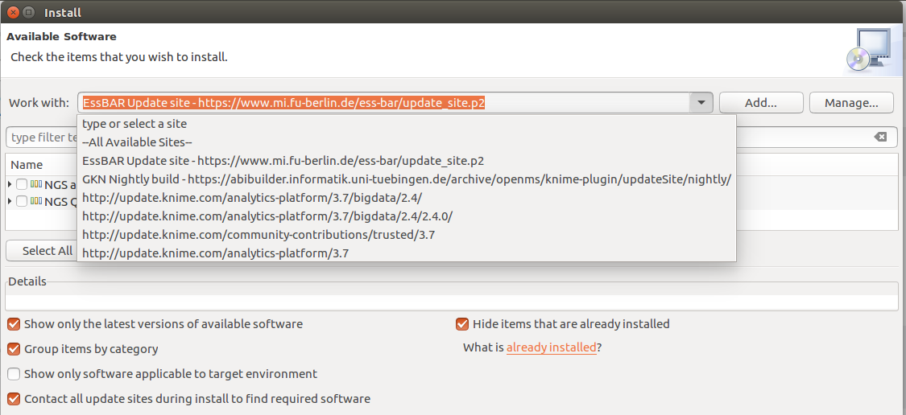
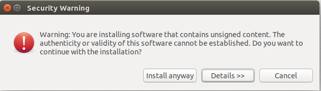
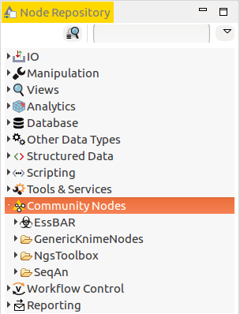
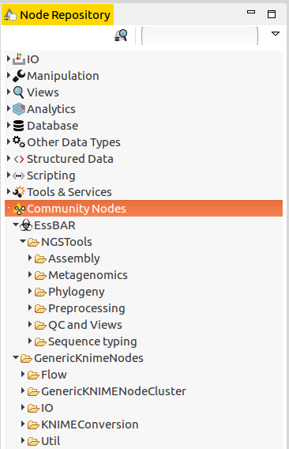

## A tool collection for metagenomics
This is a collection of KNIME nodes and workflows for detection of foodborne pathogens in metagenomic datasets and characterisation of bacterial isolates based on genome assembly.

## How to
### Prerequisites
 - Linux OS (x86_64)
 - KNIME Analytics Platform for Linux (>= version 3.1, but below version 4.0)
 
 ### KNIME Plugins
 - Ess-B.A.R. Nodes (FU Berlin EssBar update site)
 - Generic Workflow Nodes for KNIME (GGKN nightly build Uni Tuebingen) 
 - SeqAn NGS Toolbox (KNIME Community Extensions nightly build - Bioinformatics & NGS)
 - KNIME Interactive R Statistics Integration (KNIME Analytics Platform Update Site)
 - KNIME JavaScript Views (KNIME Analytics Platform Update Site)
 
### Installation of nodes using the update site  
To install required KNIME nodes you have to add the **Ess-B.A.R. nodes**, **Generic KNIME nodes** and **SeqAn NGS Toolbox** nightly build update sites as repositories within KNIME. Use ```Help -> Install New Software -> Add``` to add the following update sites:    
  - **Ess-B.A.R. (Freie Universitaet Berlin):**   
  ```https://www.mi.fu-berlin.de/ess-bar/update_site.p2```
  - **OpenMS & Generic KNIME Nodes nightly build (Uni Tuebingen):**   
  ```https://abibuilder.informatik.uni-tuebingen.de/archive/openms/knime-plugin/updateSite/nightly/```   
  - **KNIME Community Contributions nightly build:**   
  ``` http://update.knime.com/community-contributions/trunk```

   

First, work with the **Ess-B.A.R. update site** and select all displayed packages  "*NGS applications*", "*NGS QC features*" for installation and click on ```Next>```. Accept the license agreements by checking the corresponding box and click on Finish. If a security warning pops up click install anyway:  
   
    

You will be asked to restart KNIME for changes to take effect. Click on *no* and continue with the installation of the *Generic Workflow Nodes for KNIME* with ```Help -> Install New Software```. Now work with the **OpenMS & GKN nightly build site**, click on the triangle next to 'Uncategorized', select ```Generic Workflow Nodes for KNIME``` and ```Next>``` to install it.   
   
To install the *SeqAn NGS Toolbox* work with **KNIME Community Contributions nightly build**, select ```SeqAn NGS Toolbox``` from *KNIME Community Extensions (nightly build) - Bioinformatics & NGS* and install it.   
   
*R Statistics and JavaScript View nodes* can be installed via the official KNIME Analytics Platform update site e.g. ```KNIME Analytics Platform 3.7 Update Site - http://update.knime.com/analytics-platform/3.7```. Select ```KNIME Interactive R Statistics Integration``` and ```KNIME JavaScript Views``` from *KNIME & Extensions* and install it.   
   
After finishing the installation you need to restart KNIME. Afterwards the **EssBAR KNIME nodes**, **Generic KNIME nodes** and **SeqAn NGS Toolbox nodes** should be visible as Community Nodes in the KNIME Node repository:  
     
   
### Example workflows
For testing we provide several workflows with test data:
 - _Metagenomics workflow:_ [Slimm_taxonomic classification.knwf](Slimm_taxonomic_classification.knwf)
 - _De novo assembly workflow:_ [SPAdes_assembly.knwf](SPAdes_assembly.knwf)
 - _MLST workflow:_ [MLST_NGS-data.knwf](MLST_NGS-data.knwf)  
 Example data: [workflow_data.tar.gz](https://www.mi.fu-berlin.de/ess-bar/workflow_data.tar.gz)   
    
 Workflows for de novo assembly (_SPAdes_), Phylogeny (_Parsnp_, _kSNP3_) , Metagenome analysis (_Slimm_) including small example data (331 Mb):
 [Application_workflows.knar](https://www.mi.fu-berlin.de/ess-bar/Application_workflows.knar)   
    
 Nodes that are included in the NGS QC package provide an interactive view of HTML reports. The view works currently only with SWT Browser. To use SWT click on ```File -> Preferences``` and select **Internal SWT Browser (Webkit)** in settings of ```KNIME -> JavaScript Views```.

### Source code
The source code for all nodes is available at [EssBAR-KNIME-nodes](https://github.com/kneubert/EssBAR-KNIME-nodes).
